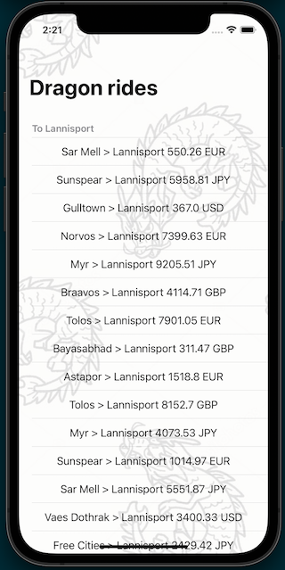

# Dragon Ride!

Imagine a place where dragons are our friends and help us to travel across the kingdom.

## This project showcases
- Model View Presenter Architecture.
- REST API Request with URL Session (No external libraries).
- Swift 5.
- Getting current location with CoreLocation.
- TableView grouped by sections.
- Programmatic UI (No storyboards.)

## Future versions

I believe great software is not done in a hurry. And there are a lot of features that with more
time I would have loved to include in this app. For example:
- Unit testing. This is very important because it helps ensuring the quality of the product. (When you deal with dragons, you don't want any errors in your app.)
- UI testing. Again. Automatized solutions that ensure quality. (Let's also think about the gold loots transported by dragons).
- SwiftUI. This is so cool. But in the instructions it mentioned the app should run on iOS 12. But, for future versions we could use bleeding edge tech.

- Beautiful UI that follows Apple Human Interface Guidelines, but at the same time reflects the identity of Odigeo.

## Screenshot

## Author

Andrés Acevedo
